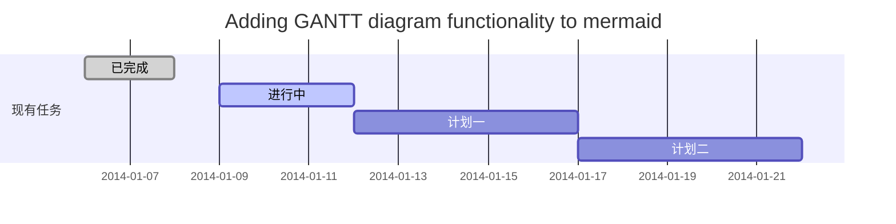
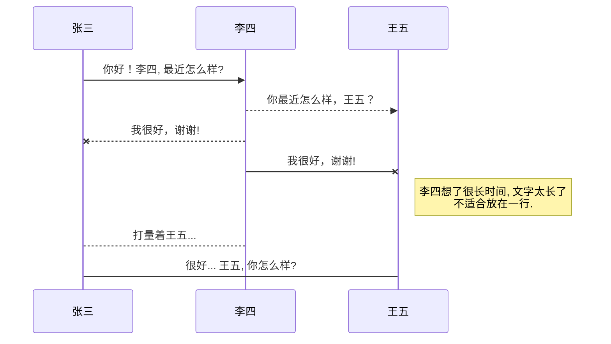
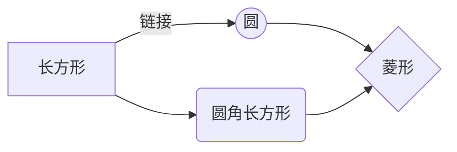

[TOC]

Markdown 作为一款专注于写作的语法工具，让人们摆脱繁琐的格式调整。以一些简单地格式标记来约定文本样式，深受广大的程序员喜欢。如果你想使用Markdown提升自己的写作效率，可以仔细阅读这篇文章，了解一下Markdown的基本语法知识。

Markdown发展至今，衍生了许多的不同版本。其中 GitHub 从自身出发，在标准的 MD 语法中延伸了自己版本，称为 Markdown GFM。

## 合理的创建标题，有助于目录的生成

直接输入1次<kbd>#</kbd>，并按下<kbd>space</kbd>后，将生成1级标题。
输入2次<kbd>#</kbd>，并按下<kbd>space</kbd>后，将生成2级标题。
以此类推，我们支持6级标题。有助于使用`TOC`语法后生成一个完美的目录。

## 文本样式

Markdown支持4中文本样式，分别是：加粗、斜体、删除线和加粗且斜体。

| 样式 | 关键字 | 快捷键 | 样例 | 输出 |
| --- | --- | --- | --- | --- |
| 加粗 | `** **`或者`__ __` | command/control+b | `**加粗文本**` | 加粗文本 |
| 斜体 | `* *`或者`_ _`  | command/control+i | `_斜体文本_` | 斜体文本 |
| 删除线 |  `~~ ~~` | 无  | `~~删除线~~` | 删除线 |
| 加粗且斜体 | `** **`和`_ _` |  无  | `**这个是：_加粗且斜体_**` | **_这个是_加粗且斜体** |

引用文本的关键词是 `>`。 例如

```sh
下面是一个引用：
>大家好！我是一个引用。
```

输入效果如下：

> 大家好！我是一个引用。

## 链接和图片

| 样式 | 关键词 | 样例 | 输出 |
| --- | --- | --- | --- |
| 链接-不显示链接地址 | `[ ]()` | `[链接](https://mp.csdn.net)` | [链接](https://mp.csdn.net) |
| 链接-显示链接地址 | `<>` | `<https://mp.csdn.net>` | <https://mp.csdn.net> |
| 图片链接 | `` | `[图片链接](https://mp.csdn.net)` | [图片链接](https://mp.csdn.net) |

## 如何插入一段漂亮的代码片

GitHub 中不支持区分不同语法的高亮，例如 Python 和 Java 的不同语法高亮形式。因此，所有设置不同的语法名称的语法，也只能显示出代码的样式。但是很多其它的MD语法解析器支持，因此通常也习惯性的加上语法。

语法高亮的关键词是**连续的三个\` 符号+高亮语法名称+代码内容+连续三个\`**.

## 生成一个适合你的列表

| 样式 | 关键词 | 样例 | 
| --- | --- | --- | 
| 无序列表 | `- ` | `- 无序1` |
| 有序列表 | `1. ` | `- 有序1` | 
| todo-未完成 | `- [ ] ` | `- [ ] 计划任务` |
| todo-完成 | `- [x] ` | `- [x] 完成任务` |

多级缩进在前级目录下，按下<kbd>tab</kbd>再进行编号。 显示效果

- 项目
  - 项目
    - 项目

1. 项目1
2. 项目2
3. 项目3

- [ ] 计划任务
- [x] 完成任务


## 创建一个表格

一个简单的表格是这么创建的：
项目     | Value
-------- | -----
电脑  | $1600
手机  | $12
导管  | $1

### 设定内容居中、居左、居右

使用`:---------:`居中
使用`:----------`居左
使用`----------:`居右

| 第一列       | 第二列         | 第三列        |
|:-----------:| -------------:|:-------------|
| 第一列文本居中 | 第二列文本居右  | 第三列文本居左 | 

分割线使用 `----` 来区分

---

以下的内容主要为扩展的 Markdown 语法

## 如何创建一个注脚

脚注的关键词是`[^数字]`，例如输入如下内容

```bash
[^1]

[^1]: 注脚的解释
```

脚注 [^1] 的输入的效果将会在文档末尾展现出来

## 注释也是必不可少的

注释关键词为 `*[注释词]: 注释内容`. 例如MD文档中输入如下内容：

```bash
Markdown将文本转换为 HTML。

*[HTML]:   超文本标记语言
```

注释中，将鼠标悬浮在注释上，将会显示注释语言。

Markdown将文本转换为 HTML。

*[HTML]:   超文本标记语言

### SmartyPants

SmartyPants将ASCII标点字符转换为“智能”印刷标点HTML实体。例如：

|    TYPE   |ASCII                          |HTML                         
|----------------|-------------------------------|-----------------------------|
|Single backticks|`'Isn't this fun?'`            |'Isn't this fun?'            |
|Quotes          |`"Isn't this fun?"`            |"Isn't this fun?"            |
|Dashes          |`-- is en-dash, --- is em-dash`|-- is en-dash, --- is em-dash|


## 创建一个自定义列表
Markdown
:  Text-to-HTML conversion tool

Authors
:  John
:  Luke

## KaTeX数学公式（GFM 不支持）

您可以使用渲染LaTeX数学表达式 [KaTeX](https://khan.github.io/KaTeX/):

Gamma公式展示 $\Gamma(n) = (n-1)!\quad\forall
n\in\mathbb N$ 是通过欧拉积分

$$
\Gamma(z) = \int_0^\infty t^{z-1}e^{-t}dt\,.
$$

> 你可以找到更多关于的信息 **LaTeX** 数学表达式[here][1].


## 新的甘特图功能，丰富你的文章


- 关于 **甘特图** 语法，参考 [这儿][2],

## UML 图表

可以使用UML图表进行渲染。 [Mermaid](https://mermaidjs.github.io/). 例如下面产生的一个序列图：:



这将产生一个流程图。:



- 关于 **Mermaid** 语法，参考 [这儿][3],

## FLowchart流程图

我们依旧会支持flowchart的流程图：
```flow
st=>start: 开始
e=>end: 结束
op=>operation: 我的操作
cond=>condition: 确认？

st->op->cond
cond(yes)->e
cond(no)->op
```

- 关于 **Flowchart流程图** 语法，参考 [这儿][4].

 [1]: http://meta.math.stackexchange.com/questions/5020/mathjax-basic-tutorial-and-quick-reference
 [2]: https://mermaidjs.github.io/
 [3]: https://mermaidjs.github.io/
 [4]: http://adrai.github.io/flowchart.js/
